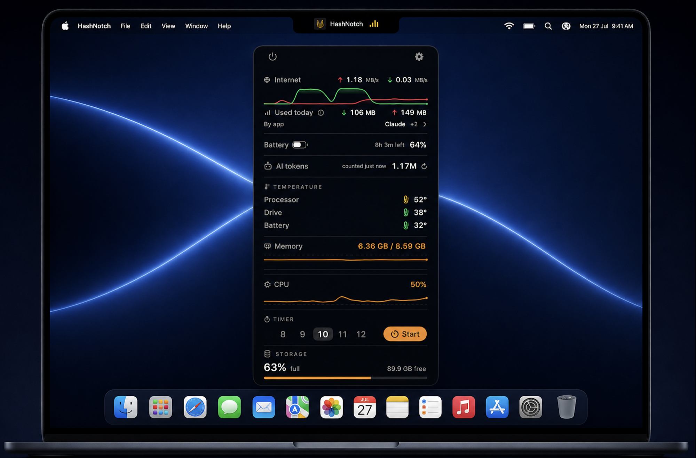
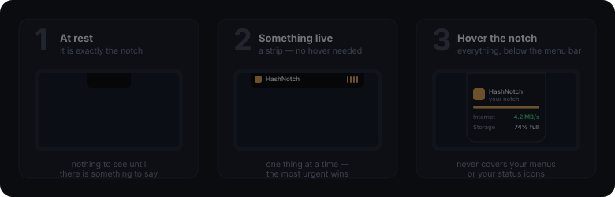
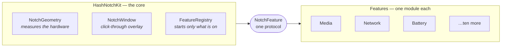

<div align="center">



<sub>The panel above is a real screenshot, placed on a picture of a MacBook. Everything on screen other than HashNotch itself — the wallpaper, the Dock and its icons, the menu bar, and the Mac — belongs to Apple Inc. and appears only to show where the app sits. HashNotch is an independent project: it is not affiliated with, endorsed by, or sponsored by Apple, and Apple, macOS, MacBook and the Apple logo are trademarks of Apple Inc. “Claude” appears in the by-app list because a program of that name used data on the day this was taken — Claude is a trademark of Anthropic PBC, and naming it is a readout of what your own Mac reports rather than an endorsement or a partnership by either side. The figures are one Mac at one moment; yours will show its own.</sub>

# HashNotch

### Hash made the Dynamic Island every Mac user deserves.

**See the unseen.**

What's playing, how fast your internet is, what your battery is doing, how hot the chip is running, what you have spent on AI today — all of it a glance away. No account. No telemetry. Nothing about you ever leaves your Mac.

<p align="center">
  
  
  
  
  
  
</p>

<a href="#-install"><b>Install</b></a> &nbsp;·&nbsp;
<a href="#-what-it-shows"><b>What it shows</b></a> &nbsp;·&nbsp;
<a href="#-why-this-one"><b>Why this one</b></a> &nbsp;·&nbsp;
<a href="#-privacy-permissions-and-terms"><b>Privacy &amp; terms</b></a> &nbsp;·&nbsp;
<a href="#-for-developers"><b>Developers</b></a>

</div>

---

## ◦ How it works

<div align="center">

</div>

Three states, and it is only ever in one of them. **At rest it is invisible** — a black shape exactly the size of your notch. **When something is happening** a slim strip appears beside it without you doing anything. **Hover the notch** and the whole panel drops down, below the menu bar, so it never covers your menus.

Swipe **down** on the notch to open it. Swipe **sideways** across the open panel to change track.

---

## ◦ What it shows

**Now playing** — anything that plays: Spotify, Apple Music, TV, Podcasts, Anghami, VLC, a browser tab. Title, artist, live position, a progress bar you can drag, and a volume slider. Album art comes from Spotify and Apple Music, and a video's thumbnail from your browser; anything else shows a placeholder tile.

**Focus** — a stretch of work, a short rest, a longer one every few rounds, counted down in the notch with the edge lit while you are meant to be working. Underneath it, one sentence: *You focused 9 hr 20 min in the last 7 days. Keep it up.*

> It knows when your screen went away, so **a stretch you walked out of ends when you left and never counts as finished** — most timers of this kind are self-reported guesses. It keeps a week so the sentence has something to add up: a date and two numbers a day, never what you were working on. Delete it any time in Settings. Nothing about your day is ever sent anywhere.

**While you were away** — shut the lid, come back, and the island says what you missed in one line: how long you were gone, how much data went through, whether the battery fell, what an agent spent. It is the only readout here about the past, and it **reads nothing of its own** — every number in it was already being kept by one of the indicators above, and this subtracts two moments of them. Only indicators that can honestly answer across an absence take part: nothing is watched while the screen is away, so anything that had to keep watching to know is left out rather than guessed at.

**Microphone and camera** — the moment any app opens your microphone or a camera, a live dot and a running timer appear beside the notch, with that app's own icon: FaceTime, Zoom, Teams, a browser call, a voice memo. One row, not two, so a video call reads as one thing — and the strip shows a microphone, a camera, or both, so a glance says which. It asks macOS one yes-or-no question per app — *does this app have an input stream open* — and one per camera — *is this camera running* — and **never listens, watches, records or transcribes**. It holds no microphone or camera permission of its own, and could not use one.

> A camera cannot be traced to an app: macOS publishes no list of which process is using one, so a camera on its own is shown as live and named as nothing rather than blamed on a likely guess. And this says an app **holds** your microphone, which is not the same as you being heard — plenty of apps, Google Meet among them, keep it open and mute in software.

**Internet** — live upload and download, with the last half-minute graphed underneath, and how much has gone through: today, this month, or since you last reset it. Underneath that, a list you can open: the three programs that used the most, each row drawn as the length it used against the biggest — so a large figure says where it went instead of just being large, and the biggest is obvious before you read a number. What one program sent and received separately is one hover away. Shut, it still names the biggest. Those three are counted only while HashNotch is running, and the panel says so: your Mac keeps no per-program history, because those counters live inside the programs themselves and go when they do. The total above them has no such limit. Your choice of span under Settings → General, and the breakdown has its own switch there.

**Battery** — a real battery filled to the level it is actually at, the way the one in your menu bar is, with time left, time to full, adapter wattage and Low Power Mode. Capped at 80% for its health? It counts down to *that*, not to a full charge it will never reach.

**Processor and memory** — how hard your Mac is working, in the same figures Activity Monitor shows.

**Temperatures** — the real sensors inside your Mac, not an estimate. On Apple Silicon it reads the on-die sensors; on every other Mac it reads the System Management Controller, so an Intel MacBook gets real readings too.

**AI tokens** — what you have spent today, across Claude Code, HashCortX and HashCerebrum. Counted on a clock of your choosing, from every ten seconds to once every two hours, whether or not the panel is open.

**Storage** — how full the disk is, using the figure `df` and Disk Utility agree on.

**Timer**, **downloads**, **AirPods charge**, and **live activities** anything can post to.

Switch any of them off, drag to reorder, restyle each one. The panel is yours — and if you go too far, one button puts the look back, and another puts everything back.

---

## ◦ Why this one

**Every app is read, not a list of supported ones.** There is no hand-written support per player: macOS itself is asked what is playing, so a niche music app, a podcast player or something released next year shows its title, artist and position on day one, with no update from me.

**One kind of network request, and only that one.** Fetching a cover — from Spotify's own image servers or YouTube's thumbnail host, over HTTPS, size-capped, refused if a redirect would leave them. Each is a separate switch in Settings, so you can allow the one you use and refuse the other, or refuse both and the app makes no network requests at all. Nothing else in the app touches the network, and nothing about you is ever sent anywhere. You can watch it with Little Snitch in about ten seconds.

**Nothing while your Mac is locked.** The island leaves the screen the moment you lock it, and every indicator stops with it — not dimmed, not covered, gone. What the notch shows is a summary of your afternoon, and a locked Mac is exactly when somebody who is not you might be standing in front of it.

**Nothing runs until you have been asked, and you can say no.** On first launch the app has read nothing. A window lists what every indicator reads, and what it will never do, and not one of them starts until you accept — until then the app is in the same state as having everything switched off, not merely promising to be. Refusing quits and takes the settings file with it, so saying no leaves your Mac as it was.

**Off means off.** Switching an indicator off stops it *reading*, not just showing. A feature that is off opens no files, runs no subprocess, and can trigger none of the permission prompts.

**One glance, then gone.** Something that just happened outranks something merely still true. A finished job takes the strip for a few seconds and hands it back to the music.

**Verified, not asserted.** 1045 automated checks run before every push — the parsers, the geometry, the privacy rules, and the arithmetic behind every readout. Every commit is signed.

```
$ swift run HashNotchChecks
  ok   a feature that is off is never started
  ok   the optimistic "could be made free" figure is not used as free space
  ok   a cover that arrives after a skip is dropped
  ok   an app outside the standard folders is refused
  ok   the checks create no preference domains at all
  ...
All checks passed.
```

---

## ◦ Install

1. Download the disk image — `HashNotch-1.3.1.dmg` — from [Releases](https://github.com/Hash-7777/HashNotch/releases/latest) and open it. Drag **HashNotch** onto the **Applications** folder shown beside it, then eject the disk image.
2. First launch, macOS says it cannot verify the developer. Click **Done**, then open **System Settings → Privacy & Security**, scroll to the bottom, and click **Open Anyway**. Once only.
3. **Hover the notch.** No Dock icon, no menu-bar item — the notch is the whole interface. The gear beside it opens settings.

### Upgrading from Hash D Island

**Drag the old `Hash D Island` app to the Trash.** Installing this one does not replace it — the two have different names, so both sit in Applications, and macOS remembers "open at login" against the *old* one. Leave it there and every restart quietly launches the old app instead of this one, which looks exactly like the new app losing all its settings: the panel comes back with nothing you chose, and the permission questions are asked again. They are not lost. The old app keeps its own separate settings, and you are looking at those.

Then open **System Settings → General → Login Items** and remove any leftover **Hash D Island** entry with the **−** button. Deleting the app does not remove that entry on its own.

Everything you set up carries over to this app the first time you open it, and the notch keeps reading the old activities folder until you re-run the Claude Code installer.

### If the app still will not open

Sometimes there is no **Open Anyway** button to click, or clicking it changes nothing. That is not a broken download. When a file arrives from the internet macOS attaches a hidden "quarantine" label to it, and for an app without a paid Apple certificate macOS will sometimes refuse it outright rather than offer you the choice.

One command removes that label:

```bash
xattr -dr com.apple.quarantine "/Applications/HashNotch.app"
```

Open **Terminal** (press ⌘Space, type `Terminal`, press Return), paste that line, press Return. It prints nothing — that means it worked. Now open the app normally.

Run it **after** the app is already in Applications. If you drag the app somewhere else afterwards, you do not need to run it again.

**What that command actually does,** because you should never paste something into a terminal on trust alone: `xattr` reads and edits the hidden labels macOS attaches to files. `com.apple.quarantine` is the one meaning "this was downloaded". The `-d` deletes that one label and `-r` applies it through the app's folder. It touches nothing else on your Mac, needs no password, and affects only this one app. You can see the label before removing it with `xattr "/Applications/HashNotch.app"`.

### Which macOS

<div align="center">

</div>

On **Monterey**, everything works except Open at Login, which needs macOS 13 — and the app says so plainly rather than failing quietly. **Big Sur** is out: some of the drawing this relies on does not exist there.

Any **Apple Silicon** Mac (M1 and later). Every macOS release gets every feature; the older ones simply do without a little polish the newer ones added — live numbers cross-fade instead of rolling like an odometer, and the settings scrollbar shows in the system's usual way. Nothing is missing, and nothing is slower.

> **Why the extra step?** It reads system-wide Now Playing and the real temperature sensors, which need Apple interfaces the App Store does not allow — so it ships straight from here. Everything it reads is spelled out in **[SECURITY.md](SECURITY.md)**.

**No notch?** It still works. The island is drawn against the top bezel and made exactly as tall as your menu bar, so it fills the one part macOS never uses — the middle, between the app menus on the left and the status icons on the right. Nudge its position and size per display in Settings.

---

## ◦ Privacy, permissions and terms

No accounts. No analytics. No telemetry. No servers. The app writes no files — its only stored state is its own settings.

### Nothing runs until you have been asked

On a new install, HashNotch has read nothing. Before a single indicator starts, a window names what each one reads and what it will never do, and **nothing begins until you accept**.

That is stricter than a notice with an OK button. Until you answer, every feature is stopped rather than started, so the app is in the same state as having everything switched off — no file is opened, no command is run, and none of the requests below can even be triggered.

**And there are two answers, not one.** *Refuse and quit* closes the app and removes its settings file, so a Mac that said no is left exactly as it was found. Open it again and it asks again. A window that offers a single button is not asking permission; it is standing in the doorway.

Once it is running, every indicator can be switched off — and switching one off stops it reading, not just showing.

### Every permission macOS may show you

Each one, when it appears, and — the question usually left out — **what you lose by refusing**.

| Permission | When you're asked | What for | If you refuse |
| --- | --- | --- | --- |
| **Control Spotify / Apple Music** | First time you press play, pause or skip on one of their tracks | Once either app is paused it hands back the system's media session, and only its own controls can restart it | Those buttons stop working *for those two apps*. Every other player is unaffected |
| **Control your browser** | Only on older systems, and only if a web video is playing with no picture found yet | To read the playing tab's address so its thumbnail can be shown. The tab list never leaves the helper — only the one picture address returns | A web video shows a plain tile instead of a thumbnail |
| **Your Downloads folder** | First time the download notice looks there | To read *file names*, so the notch can say when a download finishes | No download notice. Everything else is unaffected — or switch Downloads off and it never looks |
| **Notifications** | First time you start a timer | To post a banner when the timer ends | The timer still chimes and still shows "Time's up" at the notch |
| **Accessibility** | **Only if you switch on "Control video in your browser" yourself.** Off until you do | Pressing the keyboard's play/next/previous keys is the only way to reach a browser video, and macOS gates those three keys behind this | Media buttons still work for Spotify and Apple Music |

### What it never asks for

**Screen Recording**, **Input Monitoring** and **Full Disk Access** are never requested under any setting. If macOS ever shows you one of these in this app's name, something is wrong — don't grant it.

It also **holds no microphone permission and could not use one.** The microphone indicator asks macOS a yes-or-no question — *does this app have an input stream open* — and nothing is ever listened to, recorded or transcribed.

### The one network request

Fetching the cover for what's playing: HTTPS only, restricted to the image servers of the two services that can be reached at all — **Spotify and YouTube** — size-capped, and refused if a redirect would lead elsewhere. Each is its own switch under **Settings → General → Cover art**; turn one off and its host is refused by the downloader itself, not merely hidden, and with both off the app makes no network requests at all. It uses a throwaway session, so not even an image cache lands on disk. **Nothing else in the app touches the network**, and nothing about you is ever sent anywhere. Watch it with Little Snitch in about ten seconds.

### Terms

HashNotch is free software under the **[GNU General Public License v3](LICENSE)** or later. Use it for anything, read all of it, change it, pass it on — anything you distribute built on it stays free too, with its source available.

It comes with **no warranty of any kind**, and you run it at your own risk; the author is not liable for any loss or damage arising from its use (sections 15 and 16 of the licence). The readings are for information only — **don't rely on them where being wrong would be dangerous or costly.**

There is no account, no server and no collection, so there is nothing for anyone to hand over, sell, lose, or be compelled to produce. That is a property of how it is built rather than a promise about behaviour, and you can confirm it by reading the source.

Apple, Spotify, YouTube and every other product named here belong to their owners, are named only to say what works with what, and none of them endorse or are connected with this app.

### Removing it

Four steps, and this is every trace: switch **Open at Login** off and quit; drag the app to the Trash; delete `~/.hashnotch`; run `defaults delete com.hashnotch.app`. No launch agents, no caches, no receipts. If you ever ran it under its former name, add `~/.hashdisland` and `defaults delete com.hashdisland.app` — this app still reads both, so they are part of the list.

Every value it reads, both private Apple interfaces it uses, and the full detail: **[SECURITY.md](SECURITY.md)**. Every claim there is checkable by reading the source and pinned by the checks.

---

## ◦ When your AI tools finish

Let the notch tell you the moment a tool is done — a checkmark landing on the notch, then gone.

```sh
./scripts/install-claude-hooks.sh
```

The island lights up when **Claude Code** finishes a reply — a green hairline traces the notch for a moment — or is **waiting on you**, which holds that line amber until it is dealt with; click that one and the waiting window comes to the front. **HashCortX** and **HashCerebrum** are built in.

**It tells you; it never intercepts.** Nothing here can allow or refuse a tool call. The hook writes a local file and returns nothing your agent acts on, so no tool call is ever held open waiting for the notch — you are told something is waiting, and you answer it where it asked.

**Every other tool too.** Codex, Aider, Gemini CLI, your own scripts — anything that can run a command when it finishes can light the notch, with or without a hook system of its own. One line in your shell profile and a `;` after the command you already run.

Setup, the generic route, and the local feed any script or Shortcut can write to: **[docs/ACTIVITIES.md](docs/ACTIVITIES.md)**.

---

## ◦ For developers

A Swift package. Builds and runs with the Command Line Tools alone — no full Xcode.

```sh
swift build                 # compile
swift run HashNotch       # launch the overlay
swift run HashNotchChecks # run the checks
./scripts/build_app.sh      # assemble the .app
```

Every capability is a self-contained module. The core knows how to draw an island and how to talk to a feature through one protocol — it never knows what any feature *does*, so adding or removing one touches a single line:



```swift
// Sources/HashNotch/FeatureManifest.swift — the only place features meet
static func enabledFeatures() -> [NotchFeature] {
    FeatureRegistry.inDefaultOrder([
        MediaFeature(), ActivitiesFeature(), DownloadsFeature(),
        TimerFeature(), TokensFeature(), NetworkFeature(),
        BatteryFeature(), AirPodsFeature(), CallFeature(),
        ThermalFeature(), CPUFeature(), MemoryFeature(),
        StorageFeature(),
    ])
}
```

Architecture in full: **[docs/ARCHITECTURE.md](docs/ARCHITECTURE.md)**.

---

<div align="center">

**[GNU General Public License v3](LICENSE)** · Copyright © 2026 **Seif Hashish**

Free to use, read, change and share. Anything you distribute built on it stays free too.

[Release notes](CHANGELOG.md) · [Security & privacy](SECURITY.md) · [Architecture](docs/ARCHITECTURE.md)

</div>
